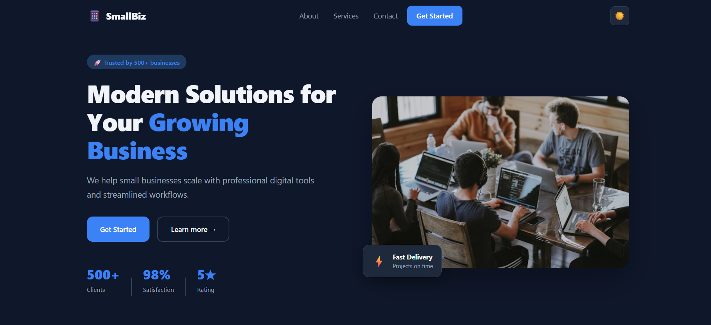

# 📱 SmallBiz — Modern Business Landing Page

A clean, professional and fully responsive business landing page built with React. Perfect for small businesses, startups and freelancers.



---

## 🚀 Live Demo

[View Live App](https://small-biz-landing.vercel.app/)

---

## ✨ Features

- 🎨 **Modern Design** — Clean professional UI
- 🌙 **Dark / Light Mode** — Smooth theme toggle
- 📱 **Fully Responsive** — Mobile, tablet and desktop
- 🧭 **Smooth Scroll Navigation** — Click links to scroll
- 📬 **Contact Form** — With success message
- ⚡ **Fast Loading** — Built with Vite
- 🎯 **Hover Animations** — Smooth interactions

---

## 📄 Sections

| Section | Description |
|---------|-------------|
| **Navbar** | Sticky nav with mobile hamburger menu |
| **Hero** | Headline, CTA buttons and stats |
| **About** | Company info with feature points |
| **Services** | 3 service cards with hover effects |
| **Contact** | Form with validation |
| **Footer** | Links and copyright |

---

## 🛠️ Tech Stack

| Technology | Purpose |
|------------|---------|
| React 18 | Frontend UI |
| Vite | Build tool |
| CSS Variables | Dark/Light theming |

---

## 📦 Setup

```bash
git clone https://github.com/abrarfahimdev/small-biz-landing.git
cd small-biz-landing
npm install
npm run dev
```

Open [http://localhost:5173](http://localhost:5173)

---

## 🚀 Deploy (Netlify)

1. Push to GitHub
2. Import on [netlify.com](https://netlify.com)
3. Click Deploy ✅

---

## 🔧 Scripts

```bash
npm run dev       # Development
npm run build     # Production build
npm run preview   # Preview build
```

---

## 🎨 Customize Colors

Edit `src/App.css`:
```css
body[data-theme='light'] {
  --accent: #2563eb;  /* Change primary color */
}
```

---

## 🤝 Use Cases

- 🏢 Small business websites
- 👨‍💼 Freelancer portfolio pages
- 🏥 Clinic or doctor websites
- 🍕 Restaurant pages
- 🏠 Real estate pages

---

## 👨‍💻 Author

**Abrar Fahim**
- GitHub: [@abrarfahimdev](https://github.com/abrarfahimdev)
- Fiverr: [abrar7780](https://fiverr.com/abrar7780)
- Email: fahimabrarcse7780@gmail.com

---

## ⭐ Support

Give it a ⭐ if you found it helpful!

---

*Built to demonstrate React component architecture and UI design skills.*
